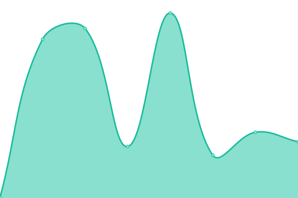
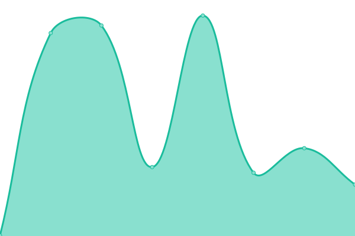

# [📈 Live Status](https://concorde-uptime.github.io/uptime-monitor): <!--live status--> **🟧 Partial outage**

This repository contains the open-source uptime monitor and status page for [concorde-uptime](https://concorde-uptime.github.io/uptime-monitor), powered by [Upptime](https://github.com/upptime/upptime).

With [Upptime](https://upptime.js.org), you can get your own unlimited and free uptime monitor and status page, powered entirely by a GitHub repository. We use [Issues](https://github.com/concorde-uptime/uptime-monitor/issues) as incident reports, [Actions](https://github.com/concorde-uptime/uptime-monitor/actions) as uptime monitors, and [Pages](https://concorde-uptime.github.io/uptime-monitor) for the status page.

<!--start: status pages-->
<!-- This summary is generated by Upptime (https://github.com/upptime/upptime) -->
<!-- Do not edit this manually, your changes will be overwritten -->
<!-- prettier-ignore -->
| URL | Status | History | Response Time | Uptime |
| --- | ------ | ------- | ------------- | ------ |
|  [Sparc](https://sparc.concorde2000.com) | 🟩 Up | [sparc.yml](https://github.com/civcicd/uptime-monitor/commits/HEAD/history/sparc.yml) | 

 240ms
     
 | 

<a href="https://uptime.civmets.app/history/sparc">100.00%</a>
    

|  [Dodmets](https://dodmets.com) | 🟩 Up | [dodmets.yml](https://github.com/civcicd/uptime-monitor/commits/HEAD/history/dodmets.yml) | 

 257ms
     
 | 

<a href="https://uptime.civmets.app/history/dodmets">100.00%</a>
    

|  [Concorde2000](https://concorde2000.com) | 🟥 Down | [concorde2000.yml](https://github.com/civcicd/uptime-monitor/commits/HEAD/history/concorde2000.yml) | 

 0ms
     
 | 

<a href="https://uptime.civmets.app/history/concorde2000">100.00%</a>
    

|  [Concorde Help](https://engage.concorde2000.com) | 🟩 Up | [concorde-help.yml](https://github.com/civcicd/uptime-monitor/commits/HEAD/history/concorde-help.yml) | 

 231ms
     
 | 

<a href="https://uptime.civmets.app/history/concorde-help">60.86%</a>
    

|  [Customer Support](https://customercare.concorde2000.com) | 🟥 Down | [customer-support.yml](https://github.com/civcicd/uptime-monitor/commits/HEAD/history/customer-support.yml) | 

 0ms
     
 | 

<a href="https://uptime.civmets.app/history/customer-support">100.00%</a>
    

|  [Civteam](https://civteam.com) | 🟩 Up | [civteam.yml](https://github.com/civcicd/uptime-monitor/commits/HEAD/history/civteam.yml) | 

 413ms
     
 | 

<a href="https://uptime.civmets.app/history/civteam">100.00%</a>
    

|  [Drivers Clearinghouse](https://www.driversclearinghouse.com) | 🟩 Up | [drivers-clearinghouse.yml](https://github.com/civcicd/uptime-monitor/commits/HEAD/history/drivers-clearinghouse.yml) | 

 225ms
     
 | 

<a href="https://uptime.civmets.app/history/drivers-clearinghouse">99.75%</a>
    

|  [FastTest](https://fasttest.concorde2000.com/Login.aspx) | 🟩 Up | [fast-test.yml](https://github.com/civcicd/uptime-monitor/commits/HEAD/history/fast-test.yml) | 

 232ms
     
 | 

<a href="https://uptime.civmets.app/history/fast-test">100.00%</a>
    

|  [Smart](https://smart.concorde2000.com) | 🟩 Up | [smart.yml](https://github.com/civcicd/uptime-monitor/commits/HEAD/history/smart.yml) | 

 349ms
     
 | 

<a href="https://uptime.civmets.app/history/smart">100.00%</a>
    

|  [Concorde Admissions](https://concordeadmissions.com) | 🟥 Down | [concorde-admissions.yml](https://github.com/civcicd/uptime-monitor/commits/HEAD/history/concorde-admissions.yml) | 

 0ms
     
 | 

<a href="https://uptime.civmets.app/history/concorde-admissions">100.00%</a>
    

|  [Concorde Analytics](https://concordeanalytics.com) | 🟩 Up | [concorde-analytics.yml](https://github.com/civcicd/uptime-monitor/commits/HEAD/history/concorde-analytics.yml) | 

 1123ms
     
 | 

<a href="https://uptime.civmets.app/history/concorde-analytics">100.00%</a>
    

|  [AppCheck](https://www09.8f7.com) | 🟩 Up | [app-check.yml](https://github.com/civcicd/uptime-monitor/commits/HEAD/history/app-check.yml) | 

 2394ms
     
 | 

<a href="https://uptime.civmets.app/history/app-check">96.27%</a>
    

|  [Medical History Survey Services](https://app-2.dodmets.com) | 🟩 Up | [medical-history-survey-services.yml](https://github.com/civcicd/uptime-monitor/commits/HEAD/history/medical-history-survey-services.yml) | 

 132ms
     
 | 

<a href="https://uptime.civmets.app/history/medical-history-survey-services">100.00%</a>
    

|  [Medical History Survey Frontend Dodmets](https://app.dodmets.com/status/test) | 🟩 Up | [medical-history-survey-frontend-dodmets.yml](https://github.com/civcicd/uptime-monitor/commits/HEAD/history/medical-history-survey-frontend-dodmets.yml) | 

 110ms
     
 | 

<a href="https://uptime.civmets.app/history/medical-history-survey-frontend-dodmets">100.00%</a>
    

|  [Medical History Survey Backend Dodmets](https://app-2.dodmets.com/api/test) | 🟩 Up | [medical-history-survey-backend-dodmets.yml](https://github.com/civcicd/uptime-monitor/commits/HEAD/history/medical-history-survey-backend-dodmets.yml) | 

 25ms
     
 | 

<a href="https://uptime.civmets.app/history/medical-history-survey-backend-dodmets">100.00%</a>
    

|  [Medical History Survey Frontend Afmets](https://usaf-civ-web-001.dodmets.com/status/test) | 🟩 Up | [medical-history-survey-frontend-afmets.yml](https://github.com/civcicd/uptime-monitor/commits/HEAD/history/medical-history-survey-frontend-afmets.yml) | 

 170ms
     
 | 

<a href="https://uptime.civmets.app/history/medical-history-survey-frontend-afmets">100.00%</a>
    

|  [Medical History Survey Backend Afmets](https://usaf-civ-web-001.dodmets.com:3000/api/test) | 🟩 Up | [medical-history-survey-backend-afmets.yml](https://github.com/civcicd/uptime-monitor/commits/HEAD/history/medical-history-survey-backend-afmets.yml) | 

 161ms
     
 | 

<a href="https://uptime.civmets.app/history/medical-history-survey-backend-afmets">100.00%</a>
    

|  [Civ Quick Messages Frontend](https://quick-messages.civmets.com) | 🟩 Up | [civ-quick-messages-frontend.yml](https://github.com/civcicd/uptime-monitor/commits/HEAD/history/civ-quick-messages-frontend.yml) | 

 169ms
     
 | 

<a href="https://uptime.civmets.app/history/civ-quick-messages-frontend">100.00%</a>
    

|  [Postal](https://postal.dodmets.com) | 🟩 Up | [postal.yml](https://github.com/civcicd/uptime-monitor/commits/HEAD/history/postal.yml) | 

 289ms
     
 | 

<a href="https://uptime.civmets.app/history/postal">100.00%</a>
    

<!--end: status pages-->

[**Visit our status website →**](https://uptime.civmets.app)

## 📄 License

- Powered by: [Upptime](https://github.com/upptime/upptime)
- Code: [MIT](./LICENSE) © [Anand Chowdhary](https://anandchowdhary.com), supported by [Pabio](https://pabio.com)
- Data in the `./history` directory: [Open Database License](https://opendatacommons.org/licenses/odbl/1-0/)
