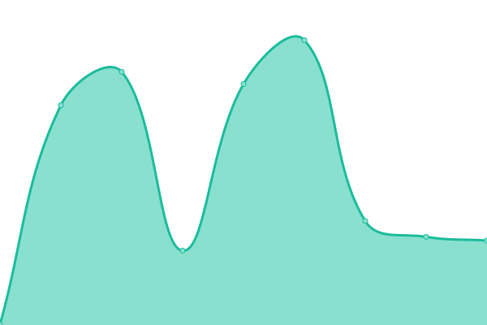
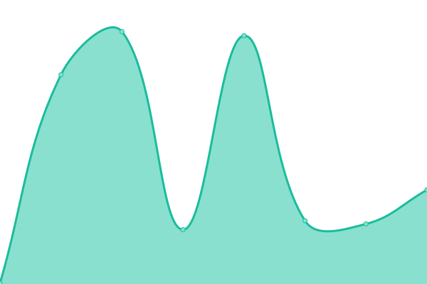
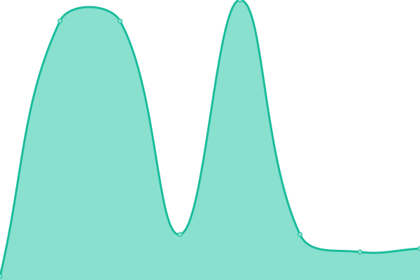

# [📈 Live Status](https://concorde-uptime.github.io/uptime-monitor): <!--live status--> **🟧 Partial outage**

This repository contains the open-source uptime monitor and status page for [concorde-uptime](https://concorde-uptime.github.io/uptime-monitor), powered by [Upptime](https://github.com/upptime/upptime).

With [Upptime](https://upptime.js.org), you can get your own unlimited and free uptime monitor and status page, powered entirely by a GitHub repository. We use [Issues](https://github.com/concorde-uptime/uptime-monitor/issues) as incident reports, [Actions](https://github.com/concorde-uptime/uptime-monitor/actions) as uptime monitors, and [Pages](https://concorde-uptime.github.io/uptime-monitor) for the status page.

<!--start: status pages-->
<!-- This summary is generated by Upptime (https://github.com/upptime/upptime) -->
<!-- Do not edit this manually, your changes will be overwritten -->
<!-- prettier-ignore -->
| URL | Status | History | Response Time | Uptime |
| --- | ------ | ------- | ------------- | ------ |
|  [Dodmets](https://dodmets.com) | 🟩 Up | [dodmets.yml](https://github.com/civcicd/uptime-monitor/commits/HEAD/history/dodmets.yml) | 

 307ms
     
 | 

<a href="https://uptime.civmets.app/history/dodmets">100.00%</a>
    

|  [Dodmets API](https://api.dodmets.com/hello/world) | 🟩 Up | [dodmets-api.yml](https://github.com/civcicd/uptime-monitor/commits/HEAD/history/dodmets-api.yml) | 

 297ms
     
 | 

<a href="https://uptime.civmets.app/history/dodmets-api">100.00%</a>
    

|  [Civteam](https://civteam.com) | 🟩 Up | [civteam.yml](https://github.com/civcicd/uptime-monitor/commits/HEAD/history/civteam.yml) | 

 373ms
     
 | 

<a href="https://uptime.civmets.app/history/civteam">100.00%</a>
    

|  [Medical History Survey Services](https://app-2.dodmets.com) | 🟩 Up | [medical-history-survey-services.yml](https://github.com/civcicd/uptime-monitor/commits/HEAD/history/medical-history-survey-services.yml) | 

 135ms
     
 | 

<a href="https://uptime.civmets.app/history/medical-history-survey-services">100.00%</a>
    

|  [Medical History Survey Frontend Dodmets](https://app.dodmets.com/status/test) | 🟩 Up | [medical-history-survey-frontend-dodmets.yml](https://github.com/civcicd/uptime-monitor/commits/HEAD/history/medical-history-survey-frontend-dodmets.yml) | 

 134ms
     
 | 

<a href="https://uptime.civmets.app/history/medical-history-survey-frontend-dodmets">100.00%</a>
    

|  [Medical History Survey Backend Dodmets](https://app-2.dodmets.com/api/test) | 🟩 Up | [medical-history-survey-backend-dodmets.yml](https://github.com/civcicd/uptime-monitor/commits/HEAD/history/medical-history-survey-backend-dodmets.yml) | 

 28ms
     
 | 

<a href="https://uptime.civmets.app/history/medical-history-survey-backend-dodmets">100.00%</a>
    

|  [Medical History Survey Frontend Afmets](https://usaf-civ-web-001.dodmets.com/status/test) | 🟩 Up | [medical-history-survey-frontend-afmets.yml](https://github.com/civcicd/uptime-monitor/commits/HEAD/history/medical-history-survey-frontend-afmets.yml) | 

 202ms
     
 | 

<a href="https://uptime.civmets.app/history/medical-history-survey-frontend-afmets">100.00%</a>
    

|  [Medical History Survey Backend Afmets](https://usaf-civ-web-001.dodmets.com:3000/api/test) | 🟥 Down | [medical-history-survey-backend-afmets.yml](https://github.com/civcicd/uptime-monitor/commits/HEAD/history/medical-history-survey-backend-afmets.yml) | 

 229ms
     
 | 

<a href="https://uptime.civmets.app/history/medical-history-survey-backend-afmets">36.07%</a>
    

|  [Civ Quick Messages Frontend](https://quick-messages.civmets.com) | 🟩 Up | [civ-quick-messages-frontend.yml](https://github.com/civcicd/uptime-monitor/commits/HEAD/history/civ-quick-messages-frontend.yml) | 

 207ms
     
 | 

<a href="https://uptime.civmets.app/history/civ-quick-messages-frontend">100.00%</a>
    

|  [Postal](https://postal.dodmets.com) | 🟩 Up | [postal.yml](https://github.com/civcicd/uptime-monitor/commits/HEAD/history/postal.yml) | 

 212ms
     
 | 

<a href="https://uptime.civmets.app/history/postal">100.00%</a>
    

|  [AF E-Opto Api](https://af-e-opto-web-app-serv-api-01.azurewebsites.us) | 🟩 Up | [af-e-opto-api.yml](https://github.com/civcicd/uptime-monitor/commits/HEAD/history/af-e-opto-api.yml) | 

 226ms
     
 | 

<a href="https://uptime.civmets.app/history/af-e-opto-api">100.00%</a>
    

|  [AF E-Opto Frontend](https://af-e-opto-web-app-serv-client-01.azurewebsites.us) | 🟩 Up | [af-e-opto-frontend.yml](https://github.com/civcicd/uptime-monitor/commits/HEAD/history/af-e-opto-frontend.yml) | 

 228ms
     
 | 

<a href="https://uptime.civmets.app/history/af-e-opto-frontend">100.00%</a>
    

|  [AF Quick Errors Api](https://af-qk-errors-serv-api-01.azurewebsites.us) | 🟩 Up | [af-quick-errors-api.yml](https://github.com/civcicd/uptime-monitor/commits/HEAD/history/af-quick-errors-api.yml) | 

 219ms
     
 | 

<a href="https://uptime.civmets.app/history/af-quick-errors-api">100.00%</a>
    

|  [AF Quick Errors Frontend](https://af-qk-errors-web-app-serv-client-01.azurewebsites.us) | 🟩 Up | [af-quick-errors-frontend.yml](https://github.com/civcicd/uptime-monitor/commits/HEAD/history/af-quick-errors-frontend.yml) | 

 206ms
     
 | 

<a href="https://uptime.civmets.app/history/af-quick-errors-frontend">100.00%</a>
    

|  [AF Password Reset Api](https://af-passwd-reset-app-serv-api-01.azurewebsites.us) | 🟩 Up | [af-password-reset-api.yml](https://github.com/civcicd/uptime-monitor/commits/HEAD/history/af-password-reset-api.yml) | 

 218ms
     
 | 

<a href="https://uptime.civmets.app/history/af-password-reset-api">100.00%</a>
    

|  [AF Password Reset Frontend](https://af-passwd-reset-web-app-client-01.azurewebsites.us) | 🟩 Up | [af-password-reset-frontend.yml](https://github.com/civcicd/uptime-monitor/commits/HEAD/history/af-password-reset-frontend.yml) | 

 217ms
     
 | 

<a href="https://uptime.civmets.app/history/af-password-reset-frontend">100.00%</a>
    

|  [AF Quick Messages Api](https://af-qk-mesg-app-serv-api-01.azurewebsites.us) | 🟩 Up | [af-quick-messages-api.yml](https://github.com/civcicd/uptime-monitor/commits/HEAD/history/af-quick-messages-api.yml) | 

 217ms
     
 | 

<a href="https://uptime.civmets.app/history/af-quick-messages-api">100.00%</a>
    

<!--end: status pages-->

[**Visit our status website →**](https://uptime.civmets.app)

## 📄 License

- Powered by: [Upptime](https://github.com/upptime/upptime)
- Code: [MIT](./LICENSE) © [Anand Chowdhary](https://anandchowdhary.com), supported by [Pabio](https://pabio.com)
- Data in the `./history` directory: [Open Database License](https://opendatacommons.org/licenses/odbl/1-0/)
